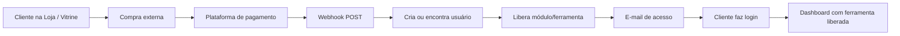

# POWER ON DECODE TOOL — Arquitetura e Memória Técnica

> **Documento permanente do projeto.**  
> Repositório: https://github.com/fabiomachado619/POWER-ON-DECODE  
> Última atualização arquitetural: **2026-06-19** (commit `18ffe7c`)

---

## Como usar este documento

**Toda nova conversa ou tarefa sobre este projeto deve começar lendo este arquivo** antes de alterar código, banco, webhooks ou deploy.

**Manutenção:** sempre que houver mudança estrutural relevante (nova ferramenta, novo fluxo de webhook, alteração de schema, mudança de deploy, nova área admin), **atualizar este documento no mesmo PR/commit** e registrar na seção [Histórico do Projeto](#histórico-do-projeto).

Documentos complementares:

| Arquivo | Conteúdo |
|---------|----------|
| `DEPLOY_SAFE.md` | Procedimentos operacionais de deploy |
| `README.md` | Instalação local e visão rápida |
| `.env.example` | Variáveis de ambiente |

---

# VISÃO GERAL DO PROJETO

## Objetivo

O **POWER ON DECODE TOOL** é uma plataforma SaaS web para aplicação **segura e autorizada** de procedimentos técnicos em arquivos EEPROM/ECU automotivos (.bin), com:

- Login e controle de acesso por módulos/ferramentas compradas
- Processamento **em memória** (arquivo original não é persistido no servidor)
- Aceite obrigatório de backup e responsabilidade técnica
- Arquitetura **modular** para adicionar novas ferramentas sem quebrar as existentes
- Integração com plataformas de pagamento via **webhooks**
- Área administrativa para gestão comercial (vitrine, usuários, acessos, e-mail)
- Área do cliente para execução das ferramentas liberadas

## Público-alvo

- Oficinas e bancadas técnicas automotivas
- Profissionais autorizados a manipular EEPROM/ECU
- Clientes finais que compram acesso a ferramentas específicas (decode, reset, odômetro, checksum)

## Estratégia comercial

| Camada | Onde fica | O que pode mudar |
|--------|-----------|------------------|
| **Comercial / vitrine** | PostgreSQL (`Tool`, `Manufacturer`, `ToolCategory`) + Admin | Nome, descrição, imagem, URL de compra, ordem, visibilidade |
| **Técnica / decode** | Código versionado (`src/tools/<slug>/`) | Regras binárias, validação, processamento — **somente via deploy Git** |
| **Acesso** | PostgreSQL (`UserModule`) | Liberação, bloqueio, validade, origem (webhook, admin, etc.) |

A vitrine pública (`/`) e a loja (`/shop`) exibem ferramentas com `active`, `visible`, `showInStore`. O admin edita metadados comerciais; **nunca** edita offsets, bytes ou algoritmos de decode pela interface.

## Fluxo de compra



1. Cliente vê ferramenta bloqueada na loja ou vitrine (`purchaseUrl` externa).
2. Compra na plataforma de pagamento (ComprouScript, Kiwify, Hotmart, etc.).
3. Plataforma dispara webhook para o servidor.
4. Sistema mapeia produto → ferramenta(s) → módulo(s).
5. Usuário é criado ou reutilizado; acesso concedido por **365 dias** (padrão).
6. E-mail automático com credenciais (novo usuário) ou confirmação de renovação.
7. Cliente acessa `/login` → `/dashboard` → **Abrir ferramenta**.

## Fluxo de liberação de acesso

**Granularidade:** acesso é por **módulo** (`Module`), não por ferramenta individual. Várias ferramentas podem compartilhar o mesmo módulo (ex.: `ssangyong`).

Funções centrais (`src/lib/accessControl.ts`):

- `grantModuleAccess()` — upsert em `UserModule` com `accessStatus: active`
- `grantToolsAccessToUser()` — agrupa ferramentas por módulo e libera
- `findOrCreateUserByEmail()` — usado por webhooks; senha padrão inicial `123456`
- `requireModuleAccess()` — usado na API de processamento e na página da ferramenta

Estados de acesso: `active`, `blocked`, `expired`, `refunded`, `canceled`.

Validade padrão: `DEFAULT_ACCESS_DAYS = 365`. Renovação estende a partir da expiração futura ou de hoje (`resolveRenewalExpiresAt`).

## Fluxo de atualização futura

1. Desenvolver localmente com `npm run dev` / `seed:dev`
2. Validar: `npm run validate:production`
3. Commit + push para GitHub (`main`)
4. Na VPS: backup → `git pull` → `docker compose up -d --build app`
5. Testar login, ferramenta antiga (regressão), webhook, PWA
6. Atualizar **este documento** se a arquitetura mudou

---

# ARQUITETURA GERAL

## Stack

| Camada | Tecnologia |
|--------|------------|
| Framework | Next.js 14 App Router + TypeScript |
| UI | React 18 + TailwindCSS |
| Banco | PostgreSQL 16 + Prisma ORM |
| Auth | JWT (`jose`) + cookie HTTP-only + bcrypt |
| E-mail | Nodemailer + templates no banco |
| Validação API | Zod |
| Deploy | Docker multi-stage + docker-compose |
| Proxy produção | Nginx ou **Caddy** (HTTPS) na VPS |

## Frontend

- **App Router** em `src/app/` — Server Components por padrão
- **Client Components** marcados com `"use client"` — formulários, cards interativos, PWA, tool runner
- **Componentes compartilhados** em `src/components/`
- **Internacionalização** via `LocaleProvider` + dicionários `src/i18n/`
- **Páginas dinâmicas** importantes: `/tools/[slug]`, `/categories/[slug]`

Regra crítica: **Client Components nunca recebem funções do registry de ferramentas** (ver [Estrutura modular](#estrutura-modular)).

## Backend

Tudo roda no mesmo processo Next.js:

- **Route Handlers** em `src/app/api/**/route.ts`
- **Lógica de negócio** em `src/lib/`
- **Motor de ferramentas** em `src/lib/toolEngine.ts`
- **Webhooks** em `src/lib/webhooks/` e `src/lib/webhookController.ts`

APIs protegidas pelo `middleware.ts` (cookie JWT). Webhooks e health check são públicos.

## Banco de dados

Schema: `prisma/schema.prisma`

### Entidades principais

| Model | Propósito |
|-------|-----------|
| `User` | Contas (role: `customer`, `admin`, `super_admin`) |
| `Module` | Agrupamento de acesso (ex.: `ssangyong`) |
| `UserModule` | Vínculo usuário ↔ módulo + validade + origem |
| `ToolCategory` | decode, reset, odometro, checksum |
| `Manufacturer` | Montadoras (SsangYong, etc.) |
| `Tool` | Metadados comerciais da vitrine |
| `DecodeProcedure` | Procedimentos legados no DB (logs) |
| `DecodeLog` | Histórico de operações (sem arquivo .bin) |
| `ProductMapping` | `external_product_id` → `toolSlug` |
| `PaymentEvent` | Log idempotente de webhooks |
| `WebhookConfig` + `WebhookConfigTool` | Webhooks custom por slug |
| `EmailSettings` / `EmailTemplate` | SMTP e templates |
| `PwaSettings` | Configuração PWA |
| `AdminAuditLog` | Auditoria admin |
| `AccessNotification` | Idempotência avisos de vencimento |

**Arquivos .bin nunca são salvos** — apenas metadados (`originalFilename`, `fileSize`, `status`, `offsetApplied`).

## Autenticação

| Item | Detalhe |
|------|---------|
| Emissão | `POST /api/auth/login` → `createSessionToken()` |
| Cookie | `podt_session` (HTTP-only, SameSite=lax) |
| TTL | 7 dias (`SESSION_MAX_AGE`) |
| Secret | `JWT_SECRET` (obrigatório em produção) |
| Payload | `{ id, name, email, role }` |
| Senha | bcrypt cost 12 |
| Logout | `POST /api/auth/logout` |
| Reset | token em `PasswordResetToken` |

### Roles

| Role | Acesso |
|------|--------|
| `customer` | Área cliente |
| `admin` | Admin (exceto SMTP, templates, administradores) |
| `super_admin` | Tudo; e-mail protegido `eletricapoweron@gmail.com` |

Middleware (`src/middleware.ts`) protege páginas cliente, admin e APIs sensíveis.

## Webhooks

Dois modelos coexistem:

### 1. Webhook genérico de pagamento

- **Rota:** `POST /api/webhooks/payment`
- **Mapeamento:** `ProductMapping` ou env `PAYMENT_PRODUCT_MAP`
- **Secret opcional:** header `x-webhook-secret` vs `PAYMENT_WEBHOOK_SECRET`
- **Providers:** generic, custom, kiwify, hotmart, cartpanda, pepper, kirvano

### 2. Webhook custom por slug amigável

- **Rota:** `POST /api/webhooks/custom/{slug}`
- **Configuração:** Admin → Webhooks (vincula ferramentas)
- **URL pública:** `{WEBHOOK_PUBLIC_BASE_URL}/api/webhooks/custom/{slug}`
- **Sem autenticação na URL** — slug identifica o webhook; campo `token` existe no DB para uso interno/legado, **não é exigido no POST**
- **CORS** habilitado para plataformas externas (`webhookCors.ts`)
- **Idempotência** por `provider + externalEventId` em `PaymentEvent`

Detalhes completos na seção [Webhooks](#webhooks-1).

## SMTP

- Configuração primária no banco (`EmailSettings`, id `default`)
- Fallback via variáveis `.env` (`SMTP_HOST`, etc.)
- Envio via `src/lib/emailService.ts` (nodemailer)
- Templates editáveis no admin (super_admin) com variáveis `{{name}}`, `{{email}}`, etc.
- Engine: `src/lib/templateEngine.ts`

## PWA

| Recurso | Arquivo |
|---------|---------|
| Manifest dinâmico | `src/app/manifest.webmanifest/route.ts` |
| Config client | `GET /api/pwa/config` |
| Service Worker | `public/sw.js` |
| Prompt instalação | `src/components/pwa/InstallPwaPrompt.tsx` |
| Admin | `/admin/pwa-settings` |

Rotas PWA usam `export const dynamic = "force-dynamic"` — **não prerenderizar** (acessam Prisma no build).

SW registrado apenas em `NODE_ENV=production`.

## Sistema de permissões

```
Usuário → UserModule (módulo ativo + não expirado) → Ferramenta (Tool.moduleId)
```

- Dashboard lista ferramentas com `hasAccess` calculado em `getUserToolsCatalog()`
- API de processamento: `requireModuleAccess(user, tool.config.moduleSlug)`
- Página `/tools/[slug]`: `assertToolAccess()` + `ToolAccessGuard`

## Área administrativa

Base: `/admin/*` — layout `AdminLayout.tsx`, APIs `/api/admin/*`

Somente roles `admin` e `super_admin`. Super admin exclusivo: SMTP, templates, administradores.

## Área do cliente

Base: `/dashboard`, `/categories/*`, `/shop`, `/catalog`, `/tools/*`, `/account/*`

Usuários autenticados com role `customer` (ou staff que acessa área cliente via link).

---

# PRINCÍPIOS DO PROJETO

Estas regras são **permanentes** e devem ser respeitadas em toda alteração:

1. **Nunca alterar uma ferramenta já validada** sem solicitação explícita do responsável técnico.
2. **Novas ferramentas = módulos independentes** em `src/tools/<slug>/` — não editar ferramentas antigas para “encaixar” a nova.
3. **Atualizações aditivas** — preferir criar arquivos/rotas novos a refatorar o que já funciona em produção.
4. **Compatibilidade** — usuários existentes, sessões e URLs públicas devem continuar funcionando.
5. **Não apagar dados de clientes** — users, password hashes, perfis.
6. **Não apagar acessos** — `UserModule` (bloquear/cancelar ≠ deletar em massa).
7. **Não apagar pagamentos** — `PaymentEvent` é log auditável.
8. **Não apagar logs** — `DecodeLog`, `AdminAuditLog`.
9. **Não alterar webhooks existentes** sem necessidade — URLs públicas já configuradas em plataformas externas.
10. **Regras técnicas de decode no Git**, nunca só no banco.
11. **Arquivos .bin em memória** — sem persistência de conteúdo binário.
12. **Client Components recebem apenas dados serializáveis** — nunca `RegisteredTool` com funções.

---

# ESTRATÉGIA DE DEPLOY

## GitHub

- Repositório único: `POWER-ON-DECODE`
- Branch principal: `main`
- Fluxo: desenvolvimento local → `validate:production` → commit → push → VPS pull

## VPS

Servidor Linux com Docker. Domínio de produção configurado (ex.: `decode.powerky.com.br`).

Variáveis críticas no `.env` da VPS:

```env
APP_URL=https://decode.seudominio.com.br
WEBHOOK_PUBLIC_BASE_URL=https://decode.seudominio.com.br
JWT_SECRET=<segredo-longo>
PAYMENT_WEBHOOK_SECRET=<opcional>
DATABASE_URL=postgresql://...
CRON_SECRET=<para job de expiração>
```

## Docker

**`Dockerfile`** — multi-stage:

1. `deps` — `npm ci` (exige `package-lock.json` sincronizado)
2. `builder` — `prisma generate` + `npm run build`
3. `runner` — Next.js standalone, user `nextjs`, porta 3000

**`docker-compose.yml`:**

| Service | Função |
|---------|--------|
| `db` | PostgreSQL 16 + volume persistente |
| `app` | Aplicação Next.js |
| `migrate` (profile `setup`) | `db push` + `seed:production` — apenas setup inicial |

## PostgreSQL

- Dados persistentes no volume `postgres_data`
- **Backup obrigatório** antes de todo deploy
- Schema via `prisma db push` ou `prisma migrate deploy` (conforme ambiente)
- Seed produção: `npm run seed:production` (idempotente, não destrutivo)

## Caddy / Nginx

O repositório **não inclui** Caddyfile versionado. Em produção:

- **Nginx** ou **Caddy** na VPS faz terminador TLS (443)
- Proxy reverso para `127.0.0.1:3000` (container `app`)
- Exemplo Nginx em `DEPLOY_SAFE.md`
- **Caddy** (alternativa): configuração equivalente com TLS automático Let's Encrypt

Requisito: DNS A/CNAME apontando para IP da VPS **antes** de configurar webhooks externos.

---

## Checklist de deploy

### Antes do deploy

- [ ] Ler este documento e identificar impacto da mudança
- [ ] Rodar localmente: `npm run validate:production`
- [ ] Confirmar `package-lock.json` sincronizado (`npm run validate:lockfile`)
- [ ] Confirmar testes de ferramentas: `npm run test:tools`
- [ ] Se nova ferramenta: registrar em `registry.ts`, seed, testes próprios
- [ ] Backup do PostgreSQL na VPS
- [ ] Verificar `.env` da VPS (URLs, secrets)
- [ ] Comunicar janela se houver downtime

### Durante o deploy

```bash
cd /caminho/do/projeto
git pull origin main
docker compose up -d --build app
# Primeira instalação ou schema novo:
# docker compose --profile setup run --rm migrate
```

- [ ] Build Docker concluiu sem erro
- [ ] Container `podt-app` está `running`
- [ ] Container `podt-postgres` healthy

### Após o deploy

- [ ] `curl https://seudominio/api/health`
- [ ] Login admin e cliente de teste
- [ ] Dashboard carrega ferramentas liberadas
- [ ] Abrir `/tools/ssangyong-rexton-25c320-decode` (regressão)
- [ ] Teste webhook interno no admin (se aplicável)
- [ ] Verificar `/api/pwa/config` e `/manifest.webmanifest`
- [ ] Conferir logs: `docker compose logs app --tail 50`

### Rollback

1. **Aplicação:** `git checkout <commit-anterior>` + `docker compose up -d --build app`
2. **Banco:** restaurar backup PostgreSQL (nunca `migrate reset` em produção)
3. **Imagens Docker:** rebuild a partir do commit anterior
4. Validar health + login + ferramenta SsangYong antes de encerrar rollback

Comandos **proibidos** em produção: ver `DEPLOY_SAFE.md` (`migrate reset`, `deleteMany` destrutivo, apagar volume DB).

---

# ESTRUTURA MODULAR

## Filosofia

Cada ferramenta é um **bloco isolado**. O registry central lista implementações; o motor genérico executa validate → process → log.

```
src/tools/
  registry.ts           # Lista RegisteredTool (servidor)
  serializable.ts       # ToolRunnerViewModel (cliente)
  types.ts              # Tipos compartilhados
  _template/            # Scaffold para npm run create:tool
  ssangyong-rexton-25c320-decode/   # Ferramenta real em produção
    tool.config.ts
    validator.ts
    processor.ts
    route.ts
    page.tsx
    tests.ts
    index.ts
```

## Papel de cada arquivo

| Arquivo | Responsabilidade | Onde roda |
|---------|------------------|-----------|
| `tool.config.ts` | Metadados: slug, nome, rota, API, módulo, EEPROM, imagem referência | Servidor + serializado para UI |
| `validator.ts` | Valida tamanho, extensão, conteúdo do .bin | **Somente servidor** |
| `processor.ts` | Aplica regra técnica, retorna buffer | **Somente servidor** |
| `route.ts` | Handler legado/export da API (opcional) | Servidor |
| `page.tsx` | Componente UI reutilizável (opcional) | Server → Client via view model |
| `tests.ts` | Testes de regressão em memória | CI / `npm run test:tools` |
| `index.ts` | Export `RegisteredTool` completo | Servidor |

## Motor genérico

`src/lib/toolEngine.ts`:

- `executeToolProcess()` — orquestra validate → process → `DecodeLog`
- `createToolProcessHandler()` — factory para `POST /api/tools/[slug]/process`
- `assertToolAccess()` — verificação de módulo na página

## Registry e serialização

`src/tools/registry.ts`:

```typescript
// Servidor — NUNCA passar ao client
getRegisteredTool(slug) → RegisteredTool | undefined

// Cliente — seguro
getToolRunnerViewModel(slug) → ToolRunnerViewModel | undefined
```

`RegisteredTool` contém `{ config, validate, process, runTests? }`.

`ToolRunnerViewModel` contém **apenas** campos serializáveis de `ToolConfig`.

Validação automática: `npm run validate:architecture` — falha se Client Component importar registry ou usar `<ToolRunnerPage tool={...} />`.

## Como criar uma nova ferramenta

```bash
npm run create:tool -- minha-ferramenta-decode \
  --name="Minha Ferramenta" \
  --category=decode \
  --manufacturer=fiat
```

1. Implementar `validator.ts` e `processor.ts`
2. Completar `tool.config.ts` (slug, apiPath, moduleSlug, etc.)
3. Escrever `tests.ts`
4. Exportar em `index.ts`
5. **Registrar** em `src/tools/registry.ts`:

```typescript
import { minhaFerramentaTool } from "@/tools/minha-ferramenta-decode";

export const toolRegistry: RegisteredTool[] = [
  ssangyongRexton25c320DecodeTool,
  minhaFerramentaTool,  // nova — não alterar as antigas
];
```

6. Sincronizar vitrine: `npm run seed:tools`
7. Validar: `npm run validate:production`

## Como registrar

- **Código:** `src/tools/registry.ts` — obrigatório para processamento
- **Banco:** seed cria/atualiza registro em `Tool` (metadados comerciais)
- **Webhook:** vincular slug em Admin → Webhooks ou Product Mappings

## Como testar

```bash
npm run test:tools          # Todas as ferramentas do registry
npm run test:tool-access    # Simula usuário webhook abrindo ferramenta
npm run validate:production # Pipeline completo
```

Regra de ouro: **testes da SsangYong devem continuar passando** após qualquer mudança.

## Ferramenta em produção (referência)

| Campo | Valor |
|-------|-------|
| Slug | `ssangyong-rexton-25c320-decode` |
| Módulo | `ssangyong` |
| EEPROM | 25C320 / 25LC320 (4096 bytes) |
| Offset | 0x03F0 (fixo no processor — não alterar sem autorização) |
| Rota | `/tools/ssangyong-rexton-25c320-decode` |
| API | `/api/tools/ssangyong-rexton-25c320-decode/process` |
| Imagem ECU | `/images/tools/ssangyong-rexton-25c320-ecu-label.png` |

---

# WEBHOOKS

## Modelo custom (recomendado para novas integrações)

| Característica | Comportamento |
|----------------|---------------|
| URL | `https://{dominio}/api/webhooks/custom/{slug-amigavel}` |
| Método | `POST` |
| Content-Type | `application/json` |
| Autenticação URL | **Nenhuma** — slug identifica o webhook |
| Token | Campo existe em `WebhookConfig.token` (DB); **não validado** no POST público |
| CORS | Sim (OPTIONS + headers) |
| Vínculo ferramentas | Admin seleciona slugs em `WebhookConfigTool` |
| Idempotência | `PaymentEvent` unique `[provider, externalEventId]` |

### Formato JSON suportado (Pedido Pago / ComprouScript)

```json
{
  "event": "pedido_pago",
  "payload": {
    "order": {
      "id": 140,
      "status": "completed"
    },
    "status": "paid",
    "product": {
      "id": "produto-externo",
      "name": "Nome do produto"
    },
    "customer": {
      "name": "Cliente",
      "email": "cliente@exemplo.com"
    },
    "payment": {
      "gateway_transaction_id": "transacao-unica-123"
    }
  }
}
```

**Aprovação** quando: `event === "pedido_pago"` OU `payload.status === "paid"` OU `order.status === "completed"`.

Normalização: `src/lib/webhooks/normalizePedidoPago.ts`

### Fluxo de processamento (custom)

1. Busca `WebhookConfig` pelo slug (ativo)
2. Parse JSON + normalização
3. Verifica idempotência em `PaymentEvent`
4. Resolve ferramentas vinculadas → módulos
5. `findOrCreateUserByEmail()` — senha padrão se novo
6. `grantModuleAccess()` — source `webhook`, 365 dias
7. `sendWebhookAccessGrantedEmail()` — template novo/existente
8. Registra `PaymentEvent` com status e mensagem

### URL pública

Construída por `buildWebhookPublicUrl()` em `src/lib/publicUrl.ts`:

```
WEBHOOK_PUBLIC_BASE_URL || APP_URL || http://localhost:3000
```

Admin exibe aviso se DNS do hostname não resolve.

## Webhook genérico de pagamento

**Rota:** `POST /api/webhooks/payment`

Headers:

- `x-webhook-provider`: generic | kiwify | hotmart | ...
- `x-webhook-secret`: opcional

JSON flat (campos normalizados por provider):

```json
{
  "customer_name": "Cliente",
  "customer_email": "cliente@exemplo.com",
  "product_id": "prod_ssangyong",
  "product_name": "SsangYong Decode",
  "status": "paid",
  "transaction_id": "tx-123"
}
```

Mapeamento: tabela `ProductMapping` ou env legado `PAYMENT_PRODUCT_MAP`.

## Criação de usuário

- E-mail normalizado (lowercase)
- Nome do payload ou parte local do e-mail
- Senha inicial: `DEFAULT_USER_PASSWORD` (`123456`) — comunicada por e-mail
- Role: `customer`

## Renovação de acesso

Compra subsequente do mesmo módulo **estende** `expiresAt` via `resolveRenewalExpiresAt()` — não cria duplicata (`@@unique([userId, moduleId])`).

## E-mails automáticos (webhook)

| Situação | Template slug |
|----------|---------------|
| Novo usuário | `access_granted_new_user` |
| Usuário existente | `access_granted_existing_user` |

Variáveis: `{{name}}`, `{{email}}`, `{{password}}`, `{{tool_name}}`, `{{expires_at}}`, `{{login_url}}`

---

# ÁREA ADMINISTRATIVA

Acesso: `/admin` — roles `admin` / `super_admin`

| Seção | Rota | Finalidade |
|-------|------|------------|
| **Dashboard** | `/admin` | Estatísticas, últimos usuários, webhooks |
| **Usuários** | `/admin/users` | CRUD, grant access, reset senha, modal edição |
| **Acessos** | `/admin/access` | Listar/bloquear/renovar/cancelar UserModules |
| **Vitrine** | `/admin/tools` | Nome, descrição, capa, ordem, URL compra — **não regras técnicas** |
| **Mapeamento produtos** | `/admin/product-mappings` | product_id externo → toolSlug |
| **Categorias** | `/admin/categories` | Decode, Reset, Odômetro, Checksum |
| **Montadoras** | `/admin/manufacturers` | Logos, ordem, ativo |
| **Webhooks** | `/admin/webhooks` | CRUD webhooks custom, vínculo ferramentas, teste interno |
| **E-mail Marketing** | `/admin/email-marketing` | Campanhas |
| **PWA** | `/admin/pwa-settings` | Nome app, cores, prompt, ativo |
| **Administradores** | `/admin/administrators` | super_admin — promover admins |
| **SMTP** | `/admin/email-settings` | super_admin — servidor de e-mail |
| **Templates** | `/admin/email-templates` | super_admin — assuntos e corpos HTML |
| **Logs Decode** | `/admin/decode-logs` | Histórico de operações |

Auditoria: `logAdminAction()` → `AdminAuditLog`

---

# ÁREA DO CLIENTE

| Seção | Rota | Finalidade |
|-------|------|------------|
| **Dashboard** | `/dashboard` | Hub: categorias, liberadas, loja, histórico |
| **Categorias** | `/categories/[slug]` | Ferramentas por tipo de serviço |
| **Loja** | `/shop` | Ferramentas para compra (sem acesso) |
| **Catálogo** | `/catalog` | Visão completa agrupada |
| **Ferramenta** | `/tools/[slug]` | Runner: referência ECU, upload, decode |
| **Minha conta** | `/account` | Perfil |
| **Meus acessos** | `/account/access` | Módulos, validade, status |
| **Alterar senha** | `/account/password` | Troca de senha autenticada |

### Estados visuais das ferramentas (`ToolCard`)

| Estado | Badge | Visual |
|--------|-------|--------|
| Liberada | Verde — `badge-unlocked` | Imagem normal, CTA "Abrir ferramenta" |
| Bloqueada | Vermelha — `badge-blocked` | Grayscale + overlay cadeado |
| Vencida | Laranja — `badge-expired` | Opacidade reduzida, CTA renovar |

### PWA (cliente)

Prompt de instalação em dashboard, account, shop, tools, categories. Config dinâmica do admin.

---

# PADRÃO VISUAL

## Tema

- **Tema claro** — fundo canvas `#F5F7FA`, superfícies brancas
- **Marca** — verde emerald `#10B981` (brand, CTAs, badges liberado)
- **Tipografia** — Inter (Google Fonts)
- **Visual profissional** — cards com sombra suave, bordas arredondadas

## Tokens (`tailwind.config.ts`)

| Token | Valor | Uso |
|-------|-------|-----|
| `brand` | #10B981 | Botões primários, destaques |
| `canvas` | #F5F7FA | Fundo geral |
| `surface` | #FFFFFF | Cards |
| `ink` | #111827 | Texto principal |

## Componentes visuais chave

- `.card`, `.card-hover` — containers
- `.btn-primary`, `.btn-secondary`, `.btn-renew` — ações
- `.badge-unlocked` (verde), `.badge-blocked` (vermelho), `.badge-expired` (laranja)
- `.tag` — chips EEPROM/categoria
- `ToolCard` — card horizontal 280px no dashboard
- `ToolReferenceImage` — imagem ECU com modal ampliado

## Itens bloqueados

- Imagem com `grayscale` + opacidade reduzida
- Overlay escuro + ícone cadeado
- Badge vermelha "BLOQUEADO"
- CTA secundário "Comprar acesso" → `purchaseUrl`

## Itens liberados

- Badge verde "LIBERADO"
- Borda sutil brand
- CTA primário "Abrir ferramenta"

---

# SUPORTE A IDIOMAS

| Locale | Arquivo | Padrão |
|--------|---------|--------|
| Português | `src/i18n/pt-BR.ts` | **Sim** |
| Espanhol | `src/i18n/es.ts` | Opcional |

### Mecanismo

- Cookie `podt_locale` (1 ano) — `POST /api/locale`
- Server: `getServerTranslations()` / `getServerLocale()`
- Client: `useI18n()` → `{ t, tr, locale }`
- Interpolação: `interpolate()` e `tr()` para `{count}`, `{date}`, etc.

### Regra para novas funcionalidades

**Toda string visível ao usuário** deve existir em `pt-BR.ts` **e** `es.ts`, e o tipo em `Dictionary` (`pt-BR.ts`) deve incluir a nova chave.

Nunca hardcodar texto em português em Client Components sem passar pelo i18n.

---

# REGRAS PARA FUTURAS CONVERSAS

Antes de **qualquer** modificação:

1. **Ler** `docs/POWER_ON_DECODE_ARCHITECTURE.md` (este arquivo)
2. **Identificar impacto** — ferramentas, webhooks, banco, deploy, UI, i18n
3. **Verificar compatibilidade** — usuários, acessos, URLs, regressão SsangYong
4. **Verificar deploy** — `validate:production`, Docker, lockfile
5. **Verificar banco** — migrations idempotentes; sem deletes destrutivos
6. **Verificar webhooks** — idempotência, URLs públicas, formato JSON
7. **Verificar regressão** — `npm run test:tools`, teste manual da ferramenta

**Nenhuma alteração deve pular esta sequência.**

### Escopo mínimo

Preferir o diff menor que resolve o problema. Não refatorar código não relacionado.

### Ferramentas validadas

`ssangyong-rexton-25c320-decode` — **não alterar** `validator.ts`, `processor.ts` ou testes sem pedido explícito.

---

# HISTÓRICO DO PROJETO

| Data | Marco | Detalhe |
|------|-------|---------|
| 2026-06 | **Criação inicial** | Next.js 14, Prisma, auth JWT, SsangYong decode, docker-compose |
| 2026-06 | **Arquitetura modular** | `src/tools/`, registry, toolEngine, template `create:tool` |
| 2026-06 | **Sistema de webhooks** | Payment genérico + custom por slug, ProductMapping, PaymentEvent |
| 2026-06 | **Sistema de acessos** | UserModule, validade 365d, expiração, cron notifications |
| 2026-06 | **Área administrativa** | Usuários, vitrine, SMTP, templates, webhooks, audit log |
| 2026-06 | **Seed produção vs dev** | `seed:production` — só SsangYong real; fictícios desativados |
| 2026-06 | **GitHub + deploy VPS** | Repo `POWER-ON-DECODE`, Docker standalone, Nginx/Caddy |
| 2026-06 | **Webhooks VPS / DNS** | `WEBHOOK_PUBLIC_BASE_URL`, health check, diagnóstico admin (`edfa409`) |
| 2026-06 | **Correção Client Component** | `ToolRunnerViewModel` serializável; sem funções no client (`3c2d71a`, `5b7ac93`) |
| 2026-06 | **Validação de deploy** | `validate:production`, `validate:architecture`, `validate:lockfile` |
| 2026-06 | **PWA dinâmico** | `force-dynamic` em rotas PWA; fix build Prisma (`d7f2df6`) |
| 2026-06 | **UX SsangYong** | Imagem etiqueta ECU + modal ampliado (`18ffe7c`) |
| 2026-06 | **Documentação arquitetura** | Este documento (`docs/POWER_ON_DECODE_ARCHITECTURE.md`) |

### Commits de referência (Git)

```
18ffe7c Imagem referência ECU SsangYong + modal
d7f2df6 Fix build PWA (force-dynamic)
5b7ac93 Arquitetura serializável + validate:production
3c2d71a Fix Client Component tool page
edfa409 Webhooks VPS + URL pública
b64cf84 Versão inicial produção
```

---

# CONCLUSÃO — Resumo executivo (10 minutos)

**O que é:** SaaS B2B/B2C para técnicos automotivos aplicarem decode/reset em arquivos .bin, com compra online e liberação automática.

**Como ganha dinheiro:** Cliente compra na plataforma externa → webhook libera acesso por 1 ano → usa ferramenta web autenticada.

**Stack em uma linha:** Next.js 14 full-stack + PostgreSQL + Docker na VPS + proxy HTTPS.

**Coração técnico:** Ferramentas modulares em `src/tools/<slug>/` com validate/process no servidor; UI recebe só metadados serializáveis.

**Única ferramenta real hoje:** SsangYong Rexton 25C320 — qualquer deploy deve preservá-la.

**Admin faz:** vitrine, usuários, acessos, webhooks, e-mail. **Admin não faz:** editar algoritmo de decode.

**Deploy seguro:** backup → git pull → docker build → health check → teste SsangYong.

**Antes de codar:** ler este doc → avaliar impacto → validar → commit → deploy → atualizar este doc.

---

*Documento mantido pelo arquiteto principal do projeto. Versão sincronizada com commit `18ffe7c`.*
